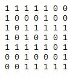
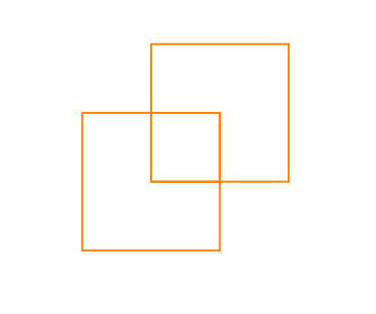

# furry-spork-latex

***

<b> Did you have problems writting 50 lines of LATEX code for hand-written finite automaton. </b> Now you don't have to, we are coming with a solution soon. Make sure to subscribe!

***

## 🚀 Introduction
Generating the latex code of the handwritten automaton using the techniques of image processing and dfa minimization.

## 🚦 Documentation
Eventually this project got divided into two parts:
#### Converting shapes in 2D matrix to Latex code
Using the concepts of computational geometry we have implemented Latex code generator from shapes consisting of 1s in 2D matrix.
- Detecting all the line segments inside the 2D shape by tracing the directions of 1s.
- Finding all the coordinates of corner points in the 2D matrix.
- Using the above detected coordinated generating the Latex code.
###### Learn more
- [util.py](https://github.com/shreyakupadhyay/furry-spork-latex/blob/master/new_PL_project/util.py) Main file python util.py matrix.txt
- [detectSolidShapes.py](https://github.com/shreyakupadhyay/furry-spork-latex/blob/master/new_PL_project/detectSolidSquare.py) Detecting solid shapes in matrix.
- [lineSegments.py](https://github.com/shreyakupadhyay/furry-spork-latex/blob/master/new_PL_project/lineSegments.py) Finding all the line segments in the 2D matrix.
- [matrix.txt](https://github.com/shreyakupadhyay/furry-spork-latex/blob/master/new_PL_project/matrix.txt) Give your 2D matrix for detecting shapes and pass it as argument while running util.py.
- [outputLatexCode.txt](https://github.com/shreyakupadhyay/furry-spork-latex/blob/master/new_PL_project/outputLatexCode.txt) Contains Latex code of the shapes given in 2D matrix.

#### Converting a handwritten automaton to Latex code
Using the techniques of Machine Learning and Image Processing implementing the solution to our problem statement.
- Detecting edges connecting two states.
- Detecting states in automaton.
- Detecting hand written characters from the image.
- DFA minimization of the drawn automaton.
- Latex code generation.

###### Learn more
- [main.py](https://github.com/shreyakupadhyay/furry-spork-latex/blob/master/code/main.py) Main file python main.py
- [min_dfa.py](https://github.com/shreyakupadhyay/furry-spork-latex/blob/master/code/min_dfa.py) Minimizing the DFA using an algorithm based on the technique of equivalence.
- [reduction.py](https://github.com/shreyakupadhyay/furry-spork-latex/blob/master/code/reduction.py) Updating the given json input into the final output after minimization.
- [generate_code.py](https://github.com/shreyakupadhyay/furry-spork-latex/blob/master/code/generate_code.py) Generating the latex code the given automaton.

#### Demo
###### 2D Matrix

###### Shape generated from output Latex code

## ☑ TODO

- [ ] Detecting edges
- [ ] Detecting shapes 
- [ ] Detecting location of shapes

## 👬 Contributors
The contributors behind this project:

#### [Gaurav Koley](https://github.com/arkokoley)

Gaurav is a GSOCer, UI Designer and an awesome web developer. He oversees the project direction, maintenance and organizes the planning and development efforts of the team.

#### [Rajavaram Harika](https://github.com/harikarajavaram)

Harika is a emerging open source contributor and developing very creative softwares using new world technologies.

#### [Suprgya Bhushan](https://github.com/suprgyabhushan)

Suprgya is a Software developer and involved with many projects and core part of our team.

#### [Shreyak Upadhyay](https://github.com/shreyakupadhyay)

Shreyak is a web scraper and backend developer. He is involved in many projects with other team members.

